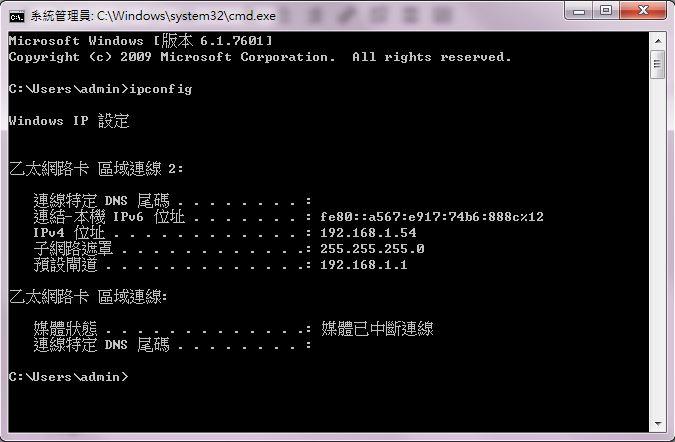

# 第十一週工作內容

*從第十一週起, 每週均進行課堂實作考試, 每週配分 20 分, 各組與成員必須透過 Github, Gitbook, Copy.com, Vimeo 與 Waffle.io 中的時間註記累積資料, 各組必須在次週上課前, 在本網誌中, 明確標示各組與各組員所完成的具體內容進行評分, 未能及時在各時段內完成帶有時間註記內容者, 均以零分計算.
*

[各班開始編寫期末報告電子書](http://wordpress-2015course.rhcloud.com/?p=1393)

[Leo升級到5.1版本](http://wordpress-2015course.rhcloud.com/?p=1387)

將proxy設定成：proxy.mde.tw

教學影片：https://vimeo.com/user24079973/videos
  
 
如何查看電腦伺服器位址：

於系統管理員(cmd)下輸入ipconfig即可查看

