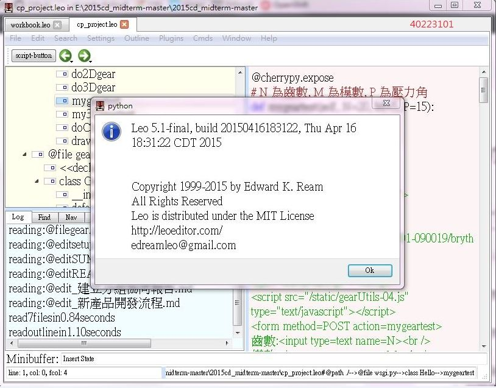

# 第十一週工作內容

*從第十一週起, 每週均進行課堂實作考試, 每週配分 20 分, 各組與成員必須透過 Github, Gitbook, Copy.com, Vimeo 與 Waffle.io 中的時間註記累積資料, 各組必須在次週上課前, 在本網誌中, 明確標示各組與各組員所完成的具體內容進行評分, 未能及時在各時段內完成帶有時間註記內容者, 均以零分計算.
*

[各班開始編寫期末報告電子書](http://wordpress-2015course.rhcloud.com/?p=1393)

[Leo升級到5.1版本](http://wordpress-2015course.rhcloud.com/?p=1387)

將proxy設定成：proxy.mde.tw

教學影片：https://vimeo.com/user24079973/videos
  
 必須將Leo從4.1升級成5.1

[Leo升級到5.1版本](http://wordpress-2015course.rhcloud.com/?p=1387)

如何更新:

* 
下載原始碼: https://github.com/leo-editor/leo-editor/releases/tag/Leo-5.1-final
* 
先刪除舊版的 V:\IDE\Python33\Lib\site-packages\leo 目錄 ，或是將其修改成leo1以備不時之需
* 
解開壓縮檔案後, 將 leo 目錄放到 V:\IDE\Python33\Lib\site-packages\ 目錄中
* 
啟動隨身程式系統後, 利用 Leo Editor 系統中的 Help->About Leo 檢查是否版次為 5.1

如何查看電腦伺服器位址：

於系統管理員(cmd)下輸入ipconfig即可查看

&nbsp;

40223101:管理wordpress和gitbook編寫 自評分數15

心得：不知道為何5.1版的leo放入學校電腦中可以正常操作，但是放進我的隨身碟回家嘗試之後發現，它會使python也無法正常開啟，還不明白是哪邊出問題。

github:

<a href="https://github.com/40223101/2015cda_g1">https://github.com/40223101/2015cda_g1</a>

openshift:

<a href="http://w11-40223101a.rhcloud.com/drawspur">http://w11-40223101a.rhcloud.com/drawspur</a>

gitbook:

<a href="https://www.gitbook.com/book/40223101/2015cda_g1/details">https://www.gitbook.com/book/40223101/2015cda_g1/details</a>

&nbsp;

&nbsp;

40223136:參與齒輪程式討論(15分)

心得:參與這次任務學習到許多關於齒輪的知識，

像是壓力角與齒數等跟齒輪間有什麼的關西，

也感謝同學的教導使程式得以完成
openshift:
<a href="http://w11-40223136.rhcloud.com/mygeartest2" target="_blank" rel="nofollow">http://w11-40223136.rhcloud.com/mygeartest2</a>

github:
<a href="https://github.com/40223136/2015w11" target="_blank" rel="nofollow">https://github.com/40223136/2015w11</a>

&nbsp;

40223119 :參與齒輪程式討論   自評15分

心得:和組員討論後完成了2D齒輪嚙合的程式，並且完成LEO 5.1的升級，再與組員討論的過程中，發現每個人的意見都會有出入，因為每個人的專長都不太一樣，所以要配合每個人的專長完成每項專案，這才是分組的目的。

github: <a href="https://github.com/40223119/2015w11.git">https://github.com/40223119/2015w11.git</a>

openshift: <a href="http://cdaw11-40223119.rhcloud.com/mygeartest2">http://cdaw11-40223119.rhcloud.com/mygeartest2</a>

40223117:參與齒輪程式討論 自評分數:15分

心得:藉由和組員之間的討論，讓我釐清一些盲點，一組當中總有能力較高的成員，觀察他如何解題、工作，真的能夠讓我精進自己，有什麼不懂的部分也能夠藉由分組討論時尋求解答。

&nbsp;

Ｏpenshift:

http://cda11-40223117.rhcloud.com/

Ｇithub:

https://github.com/40223117cda/2015_w11

&nbsp;

github:

<a href="https://github.com/40223101/2015cda_g1">https://github.com/40223101/2015cda_g1</a>

&nbsp;

gitbook:

<a href="https://www.gitbook.com/book/40223101/2015cda_g1/details">https://www.gitbook.com/book/40223101/2015cda_g1/details</a>

&nbsp;

小組自評:自評分數15
